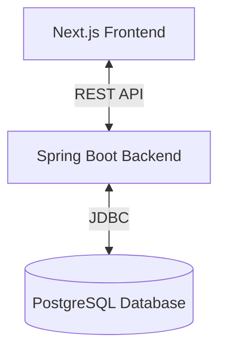

# The Oval Guide

The Oval Guide is a comprehensive platform designed to help students navigate their academic journey. It combines a robust Spring Boot API with a modern Next.js web client to facilitate searching for professors, exploring classes, and sharing course reviews.

## 🚀 Features

- **Professor Search**: Find professors by name, department, or university.
- **Class Exploration**: Browse classes and view details including difficulty and ratings.
- **Reviews**: Read and write reviews for professors and classes.
- **Authentication**: Secure user accounts with registration and login functionality.
- **Responsive Design**: A modern, mobile-friendly interface built with Tailwind CSS.

## 🏗️ Architecture

The project is structured as a monorepo containing both the backend and frontend applications.



### Components

- **Backend (`TheOvalGuide-back`)**:
  - **Framework**: Spring Boot 3.5.5 (Java 21)
  - **Database**: PostgreSQL
  - **Security**: Spring Security with cookie-based authentication
  - **Testing**: JUnit 5, Mockito, Spring Boot Test

- **Frontend (`theovalguide-front`)**:
  - **Framework**: Next.js 15 (React 19)
  - **Styling**: Tailwind CSS 4
  - **Language**: TypeScript
  - **State/Data**: React Hooks, Axios

## 🛠️ Getting Started

### Prerequisites

- **Java 21**: Required for the backend.
- **Node.js 20+**: Required for the frontend.
- **Docker**: Required for running the local PostgreSQL database.

### Quick Start

1.  **Start the Database**:
    ```bash
    cd TheOvalGuide-back
    docker compose up postgres -d
    ```

2.  **Run the Backend**:
    ```bash
    # In TheOvalGuide-back directory
    ./mvnw spring-boot:run
    ```
    The API will be available at `http://localhost:8080`.

3.  **Run the Frontend**:
    ```bash
    cd ../theovalguide-front
    pnpm install
    # Create environment file
    echo "NEXT_PUBLIC_API_URL=http://localhost:8080" > .env.local
    pnpm dev
    ```
    The web app will be available at `http://localhost:3000`.

## 🧪 Testing

### Backend
Run unit and integration tests using Maven:
```bash
cd TheOvalGuide-back
./mvnw test
```

### Frontend
Run linting to ensure code quality:
```bash
cd theovalguide-front
npm run lint
```

## 🤝 Contributing

1.  Fork the repository.
2.  Create a feature branch (`git checkout -b feature/amazing-feature`).
3.  Commit your changes (`git commit -m 'Add some amazing feature'`).
4.  Push to the branch (`git push origin feature/amazing-feature`).
5.  Open a Pull Request.

## 📚 Documentation

- [Backend README](TheOvalGuide-back/README.md)
- [Frontend README](theovalguide-front/README.md)

